# AsymetrieICP
*BERTHET Vincent*

*QUERO Benoit*
## Introduction
**@TODO**
## Environment configuration (Conda)
### Import environment
You can directly use exported environment in `./Conda/` by running the following command `conda env create -f Conda/win.yml` 

*(\*.yml prefix path value should be edit for your case)*
### Packages
The previous environment contains this packages :

[VTK](https://anaconda.org/conda-forge/vtk)  
`conda install -c conda-forge vtk `

[NumPy](https://anaconda.org/conda-forge/numpy)  
`conda install -c conda-forge numpy `

[SciPy](https://anaconda.org/conda-forge/scipy)  
`conda install -c conda-forge scipy `

## Running
### Scripts
[main.py](./Scripts/main.py) initialize VTK rendering and data loading from CSV

[rendering.py](./Scripts/rendering.py) uses to compute cloud point and plane rendering with VTK from data

[algo.py](./Scripts/algo.py) contains the implementation of algorithm from `./Docs/`

[readerVtk.py](./Scripts/readerVtk.py) display a VTK model

`python .\Scripts\main.py -f .\data\Visage_symetrique_decimated.csv`

### VTK Model

| 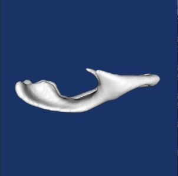 | 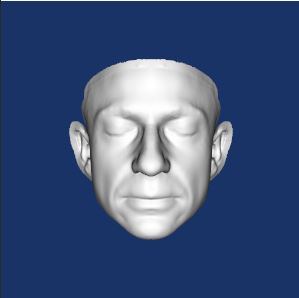 |  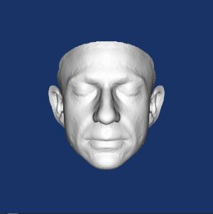 | 
|:-:|:-:|:-:| 
| [Ventricules.vtk](./Data/Ventricules.vtk) | [Visage_symetrique.vtk](./Data/Visage_symetrique.vtk) | [Visage_symetrique_decimated.vtk](./Data/Visage_symetrique_decimated.vtk) |
| 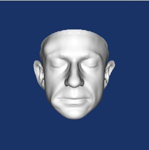 | 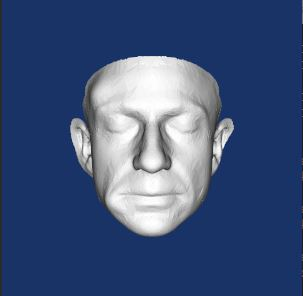 | |
| [Visage_symetrique_deforme.vtk](./Data/Visage_symetrique_deforme.vtk) | [Visage_symetrique_deforme_decimated.vtk](./Data/Visage_symetrique_deforme_decimated.vtk) | |

### Results
#### [Ventricules.csv](./Data/Ventricules.csv)

| 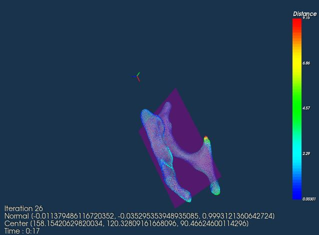 | 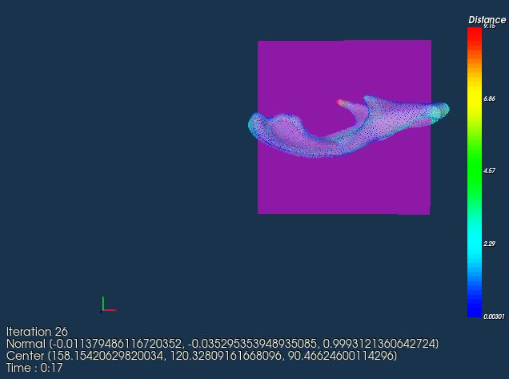 |  
|:-:|:-:|:-:| 
| Left | Front | Right |

#### [Visage_symetrique.csv](./Data/Visage_symetrique.csv)

| 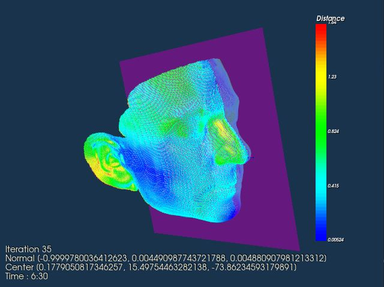 | 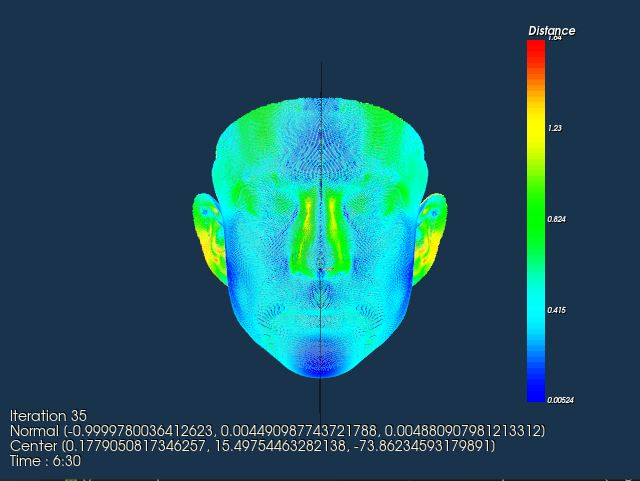 |  
|:-:|:-:|:-:| 
| Left | Front | Right |

#### [Visage_symetrique_decimated.csv](./Data/Visage_symetrique_decimated.csv)

| 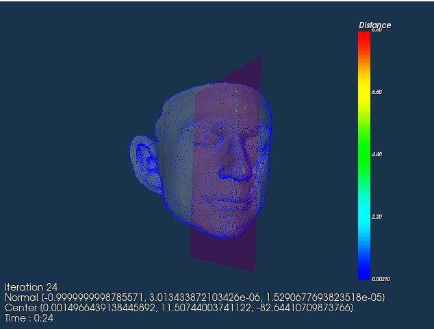 | 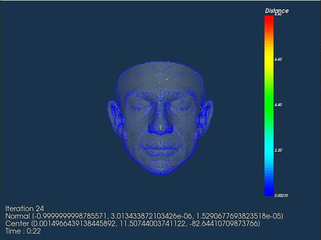 |  
|:-:|:-:|:-:| 
| Left | Front | Right |

#### [Visage_symetrique_deforme.csv](./Data/Visage_symetrique_deforme.csv)

| 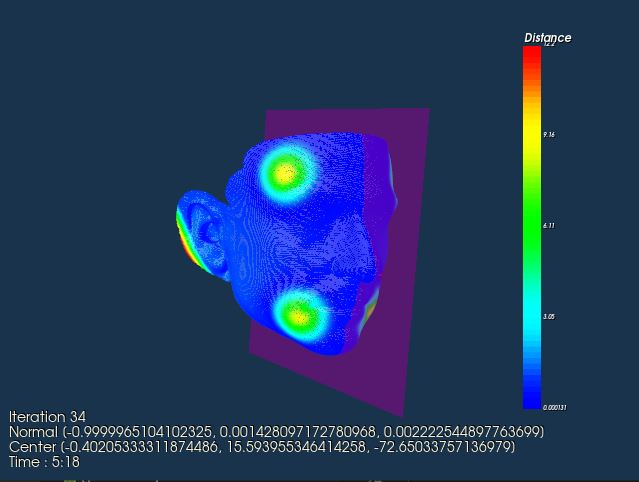 | 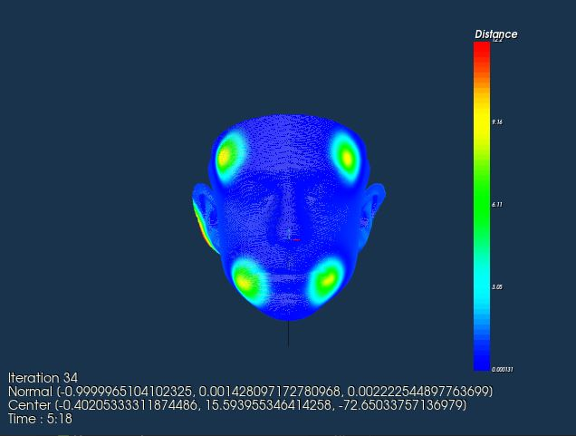 |  
|:-:|:-:|:-:| 
| Left | Front | Right |

#### [Visage_symetrique_deforme_decimated.csv](./Data/Visage_symetrique_deforme_decimated.csv)

| 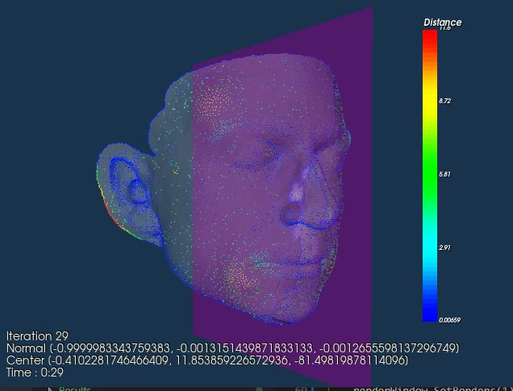 | 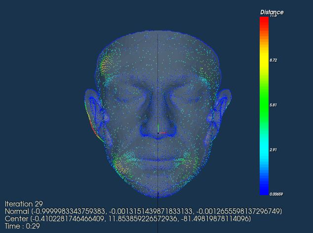 |  
|:-:|:-:|:-:| 
| Left | Front | Right |

